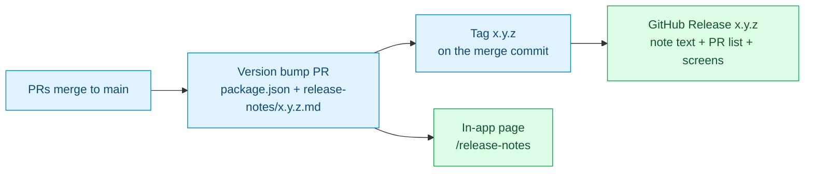

# Plan: Release Notes With Tags, Linked PRs, and Screens (#634)

Issue: https://github.com/mieweb/timehuddle/issues/634
Branch: `docs/634-release-notes-process` (cut from `main`)

## Goal

Every TimeHuddle version gets:

1. A **git tag** (`1.0.5`, with no `v` prefix, which matches the existing tag) on the `main` commit that shipped it.
2. A **GitHub Release** on that tag. Its title and text match the in-app note, and it adds the list of pull requests and their screenshots and videos.
3. An **in-app note** (`release-notes/<version>.md`) that now also shows screenshots from the PRs and a short list of the PRs it covers.

The process in [`release-notes/README.md`](../../release-notes/README.md) is updated so the next person does all three without help.

## Where things stand today

- In-app notes exist for `1.0.2` to `1.0.5`. Only `1.0.3` has screenshots. None of them link a PR.
- Only **one** tag exists: `1.0.5`, on `2b007299` (merge of #630). `1.0.2`, `1.0.3` and `1.0.4` have no tag and no GitHub Release.
- The GitHub Release for `1.0.5` is wrong in two ways:
  - Its **title** is `Huddle's feed is now an inbox`, which is the 1.0.4 headline. It should be `Your Redmine issues, inside TimeHuddle`.
  - Its **body** is missing the `@name` / `#ref` search bullet that was added to `1.0.5.md` after the release, in #631.
- Nothing automated checks a note. A bad version, date or image path silently drops the note from the page. The only check is opening the page. (`parse.ts` mentions a `notes.test.ts`, but that file does not exist.)

Where each version shipped on `main` (confirmed from `package.json` history):

| Version | Shipped in (merge on `main`) | Date       | Tag today  |
| ------- | ---------------------------- | ---------- | ---------- |
| 1.0.2   | `f67081ab` (PR #494)         | 2026-08-31 | none       |
| 1.0.3   | `20d6a53b` (PR #546)         | 2026-09-20 | none       |
| 1.0.4   | `f0193ea5` (PR #605)         | 2026-09-30 | none       |
| 1.0.5   | `2b007299` (PR #630)         | 2026-10-02 | `1.0.5` ✅ |



---

## Milestone 0: Set Up and Learn the Tools

You change nothing in this milestone. You learn the tools you will use in the rest of the plan.

- [x] `nvm use && npm install` in this worktree
- [x] `npm run dev`, then open http://localhost:3000/release-notes and read all four notes
- [x] Read [`release-notes/README.md`](../../release-notes/README.md) end to end
- [x] Learn the difference between a **tag** (a git pointer to one commit) and a **Release** (a GitHub page built on a tag, with a title, text and files). Read:
  - https://docs.github.com/en/repositories/releasing-projects-on-github/managing-releases-in-a-repository
  - https://docs.github.com/en/repositories/releasing-projects-on-github/automatically-generated-release-notes
- [x] Look at the current release and its tag:
  ```bash
  gh release view 1.0.5 --repo mieweb/timehuddle
  git fetch --tags && git show --no-patch 1.0.5
  ```
- [x] Practise without publishing anything: GitHub's generate-notes API drafts a Release body and saves nothing.
  ```bash
  gh api -X POST repos/mieweb/timehuddle/releases/generate-notes \
    -f tag_name=1.0.6 -f target_commitish=main -f previous_tag_name=1.0.5 -q .body
  ```
  `target_commitish` must be a **branch**. A commit SHA gets `400 Invalid target_commitish`. For an older version, create the tag first, then pass it as `tag_name`. Never create a tag or Release on `mieweb/timehuddle` to practise; publishing notifies everyone watching the repo.

## Milestone 1: Configure GitHub's Generated Release Notes

**Generate release notes** (the button in the issue's first photo) builds the PR list for us. Configure it so it groups PRs and leaves out Dependabot noise.

- [x] Create [`.github/release.yml`](../release.yml): one category, Dependabot excluded (44 of the PRs GitHub lists for 1.0.5 today are Dependabot bumps)
- [ ] Once the branch is pushed, check the config takes effect (it is read from the target branch). The `grep` must print `0`:
  ```bash
  gh api -X POST repos/mieweb/timehuddle/releases/generate-notes \
    -f tag_name=1.0.5 -f target_commitish=docs/634-release-notes-process -q .body | grep -c dependabot
  ```
- [x] Commit: `chore(release): configure generated release notes`

## Milestone 2: Write the Process Down

Update [`release-notes/README.md`](../../release-notes/README.md). Do not start a second document.

- [ ] Add a **"Shipping a release"** section after "Adding a note" with these numbered steps:
  1. Merge the version bump PR (`package.json` + `release-notes/<version>.md`)
  2. Find the merge commit: `git log origin/main --first-parent -1 --format=%H`
  3. Tag it and push the tag:
     ```bash
     git tag -a 1.0.6 <sha> -m "1.0.6 — <title from the note>"
     git push origin 1.0.6
     ```
  4. Create the Release: `gh release create 1.0.6 --title "<title from the note>" --notes-file <file>`, or use the web form at `/releases/new`. **Title = the note's `title:`.**
  5. Body = the note's text + **Generate release notes** PR list + screenshots and videos from those PRs (see step 4 of the template below)
- [ ] Add a **"Collecting screens from PRs"** section:
  - List the PRs in a release: `gh pr list --repo mieweb/timehuddle --state merged --search "merged:<prev-date>..<this-date>" --json number,title,url`
  - Find the media in one PR: `gh pr view <n> --repo mieweb/timehuddle --json body -q .body | grep -oE 'https://github.com/user-attachments/assets/[a-z0-9-]+'`
  - **GitHub Release**: paste the `user-attachments` URL as is. GitHub shows images **and** videos inline.
  - **In-app note**: images must be **downloaded, cropped, compressed and committed** to `assets/<version>/` (the existing size rules apply). **Videos are never committed.** Link to the PR that shows the video, or to a YouTube upload if there is one.
- [ ] Update the **Template** with a closing section:
  ```markdown
  ## Pull requests in this release

  - Redmine integration ([#560](https://github.com/mieweb/timehuddle/pull/560))
  - Tickets search by person and reference ([#631](https://github.com/mieweb/timehuddle/pull/631))
  ```
  Leave out Dependabot and pure-refactor PRs. Readers are users, so describe each PR in plain words, not by its commit-style title.
- [ ] Update the README's Mermaid diagram with the Tag → Release step
- [ ] Remove the stale `notes.test.ts` mention in the comments at the top of [`parse.ts`](../../src/features/release-notes/parse.ts) and in `notes.ts` (the file does not exist), or ask the reviewer whether they want the test written instead
- [ ] Commit: `docs(release-notes): document tagging, GitHub Releases, PR links and screens`

## Milestone 3: Fill In Past Notes (In-App)

Apply the new template to the notes already on the page.

- [ ] For **each** of `1.0.2`, `1.0.3`, `1.0.4` and `1.0.5`:
  - [ ] List the PRs merged between the previous version's ship commit and this one (table above):
    ```bash
    git log <prev-sha>..<this-sha> --first-parent --merges --format='%s'
    ```
  - [ ] Add a `## Pull requests in this release` section to the note
  - [ ] Pull images from those PRs into `release-notes/assets/<version>/`, compressed (check each file with `ls -lh`)
  - [ ] Add at most two or three images per note, placed next to the paragraph they illustrate, each with real alt text
  - [ ] Link videos to their PR (or YouTube), never commit them
- [ ] `npm run dev` and check **both** `/release-notes` and `/app/release-notes`: all four notes show, every image loads, every link opens the right PR
- [ ] Check the page in dark mode and at phone width (images must not overflow)
- [ ] Commit per version, e.g. `docs(release-notes): link PRs and screens in 1.0.4`

## Milestone 4: Open the PR

- [ ] `npm run lint && npm run typecheck && npm run format`, all clean
- [ ] `npm run test:all` passes (tell the reviewer if e2e can't run locally)
- [ ] Before/after screenshots of `/release-notes` in the PR description
- [ ] PR title: `docs(release-notes): tag releases and link PRs and screens (#634)`
- [ ] PR body says `Closes #634`. Don't close the issue until Milestone 5 is done.

## Milestone 5: Tag and Release Past Versions

⚠️ This milestone writes to the **real repo**. Get your reviewer's OK before you start it, and do it **after** the Milestone 4 PR has merged so the text matches what is on `main`.

- [ ] Create the missing tags on the ship commits from the table:
  ```bash
  git tag -a 1.0.2 f67081ab -m "1.0.2"
  git tag -a 1.0.3 20d6a53b -m "1.0.3"
  git tag -a 1.0.4 f0193ea5 -m "1.0.4"
  git push origin 1.0.2 1.0.3 1.0.4
  ```
- [ ] Create a GitHub Release for each, oldest first so `1.0.5` stays **Latest**. Use the title from each note and set "Previous tag" so Generate release notes covers the right range. Pass `--latest=false` for the older ones.
- [ ] **Fix `1.0.5`**: `gh release edit 1.0.5 --title "Your Redmine issues, inside TimeHuddle" --notes-file <file>` with the current `1.0.5.md` body + PR list + screens
- [ ] Open https://github.com/mieweb/timehuddle/releases and confirm: four releases, newest is Latest, titles match the in-app page, and images and videos play

## Definition of Done

- [ ] Tags `1.0.2` to `1.0.5` exist on the commits that shipped them
- [ ] A GitHub Release exists for each, titled to match its in-app note, with the PR list and screens
- [ ] Each in-app note lists its PRs and shows screenshots where the change is visual
- [ ] `release-notes/README.md` tells the next person how to tag, release and collect screens, and the next release (`1.0.6`) is shipped by following it with no extra help

## Out of Scope (for Now)

- Automating tags or Releases from the `ota-publish.yml` workflow (a good follow-up once the manual steps have been done a few times)
- Writing the missing `notes.test.ts` validator
- Re-hosting PR videos on YouTube (needs a decision on whose channel)
