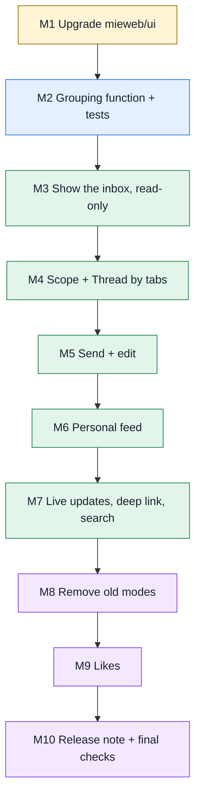

# Huddle SuperChat Inbox: Execution Plan

**Issue:** [#601 Replace the Huddle Feed Modes With the SuperChat Inbox](https://github.com/mieweb/timehuddle/issues/601)
**Branch:** `feat/huddle-superchat-inbox`
**Related:** [`superchat-inbox-gaps.md`](superchat-inbox-gaps.md) (what the component can't do yet;
don't build any of it here)

This plan breaks #601 into small milestones. Each one ends in something you can run and show.
Finish a milestone, tick its boxes, push, and ask for a review before starting the next one.

## Before You Start

- [ ] Read issue #601 end to end, including **Out of Scope**.
- [ ] Open the prototype built on the real component and click every Scope and Thread by tab:
      https://claude.ai/artifact/5TYzdgArrh5nBUV5ZVXVu7 (ask for access if it doesn't open).
      Your finished page should behave like it.
- [ ] Read `CLAUDE.md` (project rules), `release-notes/README.md`, and the `SuperChatInbox`
      story in Storybook: https://ui.mieweb.org/?path=/story/superchat-inbox--playground
- [ ] Run `nvm use && npm install`, then start the app and backend and log in. Open Huddle and try
      the card view, the chat view and Drafts, so you know what's being replaced.
- [ ] Skim these files (you'll touch most of them):

| File                                         | What it is                                                                     |
| -------------------------------------------- | ------------------------------------------------------------------------------ |
| `src/pages/Huddle.tsx`                       | The page. Feed/Drafts tabs, cards/chat toggle, loading, DDP, deep link, search |
| `src/features/huddle/superChatFeed.ts`       | Turns posts into **one** SuperChat conversation today. You'll replace this     |
| `src/features/huddle/PostCard/`              | Card view (likes, comments). Removed in Milestone 8                            |
| `src/features/huddle/HuddleComments/`        | Comments under a card. Removed in Milestone 8                                  |
| `src/features/huddle/HuddleComposer.tsx`     | Rich editor. **Stays**: `DraftsPanel` still uses it                            |
| `src/features/huddle/useAttachmentUpload.ts` | Existing upload flow for attachments                                           |
| `src/lib/api.ts` (`huddleApi`, `HuddlePost`) | `getPosts`, `createPost`, `updatePost`, `toggleLike`                           |
| `src/lib/ddp.ts` (`useLiveClockEvents`)      | Open (live) clock sessions for a team                                          |
| `meteor-backend/server/huddle.js`            | Backend methods (`huddle.getPosts`, `huddle.getComments`, …)                   |
| `meteor-backend/server/main.js`              | `Wormhole.expose(...)`: a method must be listed here or REST calls 404         |



**Suggested PRs** (each one references #601): PR 1 = M1. PR 2 = M2–M4. PR 3 = M5. PR 4 = M6.
PR 5 = M7–M10. Small PRs are easier to review and to revert.

**Every time you commit:** the pre-commit hook runs lint and Prettier. Don't skip it.

---

## Milestone 1: Upgrade `@mieweb/ui`

**Goal:** the app runs on the latest `@mieweb/ui` with nothing broken.

- [x] Check the latest version: `npm view @mieweb/ui version`.
- [x] `npm install @mieweb/ui@<latest>` and commit `package.json` and `package-lock.json`.
- [x] Run `npx @mieweb/ui@<latest> init-agent` and commit what it changes. (No diff — the generated
      instructions are byte-for-byte identical between 0.9.0 and 0.10.0.)
- [x] Update the version mentioned in the `@mieweb/ui Usage` section of `CLAUDE.md`.
- [x] Open the new SuperChat types (`node_modules/@mieweb/ui/dist/components/SuperChat/index.d.ts`)
      and write down anything new compared to the gap list (reactions? reply? composer slots? date
      separators?). **Nothing changed** — the `SuperChat`/`SuperChatInbox`/`SuperChatConversation`/
      `SuperChatMessage` type surface is identical between 0.9.0 and 0.10.0 (noted in
      `docs/superchat-inbox-gaps.md`). Posting to #601 needs explicit go-ahead before commenting on
      a GitHub issue from this session — flagged to the user instead of auto-posting.
- [x] Smoke-test: edit an existing Huddle post and check the editor loads its text (Kerebron
      seeding). Do a full clock-in and clock-out. **Could not run interactively** — this
      environment's browser tool can't open the DDP WebSocket to the LAN-IP-bound dev backend (see
      `/memories/repo/dev-environment-topology.md`). Verified instead via identical type surface
      (no Kerebron/editor-relevant change) plus the checks below.
- [x] `npm run lint && npm run typecheck && npm run format` pass. Full `vitest run` (154 tests) also
      passes.

**Done when:** the app works as before on the new version, and the "what's new" comment is on #601.

> 💡 If the upgrade breaks something unrelated to Huddle, stop and ask. Don't fix other pages in
> this branch.

---

## Milestone 2: Grouping Function and Tests (No UI Yet)

**Goal:** a pure function that turns posts into inbox conversations, fully tested. Doing this
first means the hard logic is correct before any UI exists.

- [x] In `src/features/huddle/superChatFeed.ts`, add:
  ```ts
  export type ThreadBy = 'session' | 'day' | 'person' | 'ticket';
  export function postsToConversations(
    posts: HuddlePost[],
    threadBy: ThreadBy,
    viewer: { userId: string; isAdmin: boolean },
  ): SuperChatConversation[];
  ```
- [x] Group posts with one key function per option:
  - [x] **session:** `post.clockEventId`. Posts without one: key `${userId}:${postDate}`.
  - [x] **day:** `post.postDate` (fall back to the date part of `createdAt`).
  - [x] **person:** `post.userId`.
  - [x] **ticket:** `post.ticketId`, or `'none'` for a "No ticket" thread.
- [x] Build each conversation:
  - [x] `id`: `${threadBy}:${key}`, so ids don't clash between groupings.
  - [x] `title` (plain text): for sessions `Aisha Khan · Tue, Sep 29 · 08:58–now · ● Live`. Show
        `You` for the viewer's own threads. Admins also get hours (`· 8h 18m`) and `· ⚠ no wrap-up`
        when a finished session has no post with `wrapUpAt`.
  - [x] Clock-in / clock-out as `type: 'system'` messages from `post.session.startTime` /
        `endTime` (session, day and person only; **not** ticket).
  - [x] Each post as a message. Body first, then the label, e.g.
        `Checklist UI is done.\n\n*Plan · 🎫 Onboarding checklist*`. The sidebar preview shows the
        first line, so the body must come first.
  - [x] Reuse the existing `postToMessageText` attachment handling (images, file links).
  - [x] `participants`: every post author with `color` from `getUserColor`,
        plus a `system` participant for the clock.
  - [x] `lastActivity`: the newest message time; for live sessions use "now" so they sort first.
- [x] Keep the old `postsToConversation` for now; the page still uses it until Milestone 3.
- [x] Create `src/features/huddle/superChatFeed.test.ts` with fixtures. Test at least:
  - [x] Each grouping puts the right posts in the right conversations.
  - [x] A live session (no `endTime`) is marked `● Live` and has no clock-out message.
  - [x] Admin titles show hours; member titles don't.
  - [x] Posts with no `clockEventId` and posts with no ticket are handled.
  - [x] Ticket threads have no clock messages.
- [x] `npx vitest run src/features/huddle` passes. (The Vitest suite doesn't run in CI, so run it
      yourself.)

**Done when:** tests pass and a reviewer has read the function.

> 💡 Keep it pure: no React, no API calls, no `Date.now()` inside. Pass "now" in if you need it,
> so tests are stable.

---

## Milestone 3: Show the Inbox (Read-Only)

**Goal:** the Huddle feed shows `SuperChatInbox`, grouped by session, for the selected team.

- [x] In `Huddle.tsx`, replace the chat view's `<SuperChat …>` with `<SuperChatInbox …>` from
      `@mieweb/ui/components/SuperChat`.
- [x] Feed it `postsToConversations(filteredPosts, 'session', viewer)` inside `useMemo`
      (copy how the existing `conversationKey` memo avoids recomputing on every render).
- [x] Pass `currentParticipantId={user.id}`, the existing `renderPlugins`, `virtualized`, and
      `readOnly` for now.
- [x] Make it the default view (set `feedView` to `'chat'`). Don't delete the card view yet.
- [x] Give the inbox a fixed height so it scrolls inside the page (check on a phone-sized window).
      (Unverified interactively — see the M1 note on this environment's browser/DDP limitation;
      the wrapping `div` is unchanged from the working `SuperChat` layout it replaces.)
- [x] Get `isAdmin` from the team you already load (`team.admins` includes `user.id`).

**Done when:** you can open Huddle, see one conversation per session, click through them, and the
list scrolls on mobile.

---

## Milestone 4: Scope and Thread By Tabs

**Goal:** the user can switch grouping and team from two tab bars above the inbox.

- [x] Add two `Tabs` from `@mieweb/ui` (copy the existing Feed/Drafts `Tabs` usage):
  - [x] **Thread by:** Session, Day, Person, Ticket.
  - [x] **Scope:** one tab per team from `useTeam()`, plus **Me · all teams** (disabled until
        Milestone 6).
- [x] Choosing a team in Scope calls `setSelectedTeamId` so the rest of the app stays in sync.
- [x] Save the Thread by choice in `localStorage` (wrap it in `try/catch`) and restore it on load.
- [x] Switching Thread by must **not** refetch: it only re-runs the grouping function.
- [x] Each tab list has an `aria-label`. All tab text goes through the same pattern the page uses
      for other labels.
- [x] Check it at phone width: tabs wrap or scroll, and nothing overflows the page. (Both
      `TabsList`s take `flex-wrap`; unverified in an actual phone-width browser — see the M1 note
      on this environment's browser/DDP limitation.)

**Done when:** all four groupings work for a team, and the choice survives a reload.

---

## Milestone 5: Send and Edit

**Goal:** people can post and edit from the inbox's message box. There are no comments (see
**Out of Scope** at the end of this plan).

- [x] Make the active conversation controlled: keep `activeConversationId` in state and update it
      in `onConversationOpened`.
- [x] Set `readOnly` from the active conversation, so the message box only works where posting
      makes sense:
  - [x] **Session and Person threads:** writable only if the thread is yours.
  - [x] **Day and Ticket threads:** writable for everyone (sending creates your own post).
  - [x] Other people's Session and Person threads show the component's "Read-only conversation"
        placeholder.
- [x] Handle `onMessageSent(text, { conversation, attachments })` with `huddleApi.createPost`:
  - [x] Always send `teamId` and `postDate`.
  - [x] **Your Session thread:** add the thread's `clockEventId`.
  - [x] **Ticket thread:** add the thread's `ticketId` (not for "No ticket").
  - [x] `attachments` arrive as `data:` URLs. Turn each into a `File` and upload it with the same
        flow `useAttachmentUpload` uses, then pass the results as `attachments`.
- [x] Keep `onMessageEdited` → `huddleApi.updatePost` and the `ComposerError` banner. Every
      message you can edit is one of your posts, so no extra routing is needed.
- [x] Show an error if sending fails (reuse `ComposerError` and `composerErrorMessage`).
- [x] Add a small pure helper `canPostIn(conversation, threadBy, viewer)` in `superChatFeed.ts`
      and test it.
- [x] Test in two browsers logged in as two users: a new post appears for the other user.
      (Unverified interactively — see the M1 note on this environment's browser/DDP limitation;
      the write path reuses `refreshFeed`/DDP sync unchanged from the card view.)

**Done when:** posting, editing and attaching an image all work, other people's session threads
are read-only, and failures show a message.

> 💡 The inbox's message box has no Pulse or ticket buttons. That's expected (see **Out of Scope**
> in #601). Don't add a second composer.

---

## Milestone 6: Personal Feed (Me · All Teams)

**Goal:** the **Me** scope shows the user's own posts from every team, with the same Thread by
options, posting and editing.

- [x] Backend: add `huddle.getMyPosts({ since })` in `huddle.js`, returning the caller's published
      posts from all their teams (limit to a date range, e.g. the last 30 days). Return the same
      fields as `huddle.getPosts`.
- [x] Register it in `main.js` with `Wormhole.expose(...)`.
- [x] Add `huddleApi.getMyPosts` in `src/lib/api.ts`.
- [x] Enable the **Me · all teams** tab. When it's selected, load with `getMyPosts` instead of
      the team feed.
- [x] Show which team each message came from (add `· Platform Team` to the message label; the
      team name comes from `useTeam().allTeams`).
- [x] Sending in the Me scope posts to the thread's team (every post has a `teamId`).
- [x] Add a grouping test with posts from two teams.

**Done when:** a user in two teams sees their posts from both, grouped by any option, and can post
back into either team.

---

## Milestone 7: Live Updates, Deep Link and Search

**Goal:** the inbox stays live and the existing entry points still work.

- [x] **Live posts:** new and edited posts from DDP appear without a reload (check with two
      browsers). (Unchanged from before the migration for the team scope — `syncPosts`/
      `onCollectionChange` still drive `posts`. The "Me" scope has no cross-team subscription;
      it's REST-refreshed by pull-to-refresh and the same live-clock-event effect used for
      sessions, not push. Unverified interactively — see the M1 note.)
- [x] **Live sessions:** use `useLiveClockEvents` so a clock-out updates the thread title (drops
      `● Live`, adds the clock-out message) without a reload. (`liveClockEvents` now also covers
      every team in the "Me" scope; since clocking out doesn't touch the huddlePosts document
      itself, a change in `activeClockEventIds` triggers a REST refetch of the active scope so the
      session's real `endTime` lands in the next render, rather than patching a "live" flag onto a
      stale snapshot.)
- [x] **Pull-to-refresh / REST fallback:** still works (`useRefresh(refreshFeed)`). (Now
      `useRefresh(refreshActiveScope)`, which refetches whichever scope — team or "Me" — is open.)
- [x] **Deep link:** `/app/huddle?postId=…&teamId=…` switches team (already works), then sets
      Thread by to Session and opens the conversation containing that post with
      `activeConversationId`. Test from a notification and from Dashboard → Recent Activity.
      (Wired; unverified interactively — see the M1 note. The classic card view's own
      highlight/scroll is untouched for anyone still toggled into it.)
- [x] **Search:** filters posts **before** grouping, so it works in every Thread by option.
      (Unchanged — `filteredPosts` already fed `postsToConversations` before this milestone.)

**Done when:** each item above is checked in the browser.

---

## Milestone 8: Remove the Old Modes

**Goal:** only the inbox is left. Drafts stay.

- [x] Remove the cards/chat toggle button and the `feedView` state.
- [x] Remove the card view from `Huddle.tsx`.
- [x] **Keep** the Feed / Drafts tabs, `DraftsPanel` and `HuddleComposer` (Drafts uses it).
- [x] ~~Remove the `HuddleComposer` that sits above the feed~~ **Restored per user request** after
      this milestone shipped: the composer above the Feed tab (team scope only) is back, posting
      through it the same way it always did. It's an additional way to post alongside sending
      from inside an open `SuperChatInbox` conversation — not a replacement for either.
- [x] Existing comments are no longer shown anywhere. **Don't delete comment data or the
      comment backend methods**; comments may come back once the inbox supports replies.
- [x] Move `PostCard/` and `HuddleComments/` to `.attic/` with a short `README` saying why and
      when (check nothing else imports them first: `grep -r "PostCard\|HuddleComments" src`).
- [x] Delete the old `postsToConversation` and any now-unused imports and icons.
- [x] `npm run lint && npm run typecheck` pass with no unused-code warnings.

> ⚠️ **Follow-up needed — larger than first scoped, partially resolved by the composer restore
> above:** running the suite (`npm run test`) surfaced that the shared
> `tests/e2e/huddle/helpers.ts` → `openComposer()` clicks the top composer's "Share an update..."
> placeholder — removing it broke **every** spec that calls `openComposer`, not just the ones that
> toggle to card view. Restoring the composer should fix the `openComposer`-only specs:
> `composer-actions`, `composer-failures`, `composer-responsive`, `edit-post-works`,
> `large-uploads`, `post-progress-bar`, `pulsevault-video` (unverified — not re-run after the
> restore). **Still genuinely broken** (depend on the removed card view /
> `data-testid="post-card"` / `#huddle-post-<id>`, which is still gone): `composer-paste` (asserts
> on `post-card` for the pasted image), `edit-composer-remount`, `yjs-collab-editing`,
> `tests/e2e/realtime/huddle-posts.spec.ts`, `tests/e2e/realtime/huddle-refresh.spec.ts`,
> `tests/e2e/notifications/deep-links.spec.ts`, and the shared `tests/e2e/pages/HuddlePage.ts`
> page object. These need `postContainer`/`switchToCardView` (and direct card-view references)
> rewritten against `SuperChatInbox`'s own conversation thread instead of `PostCard`. Not done in
> this session: rewriting several interdependent Playwright files without being able to confirm a
> run completes in this sandbox was judged riskier than leaving it as an explicit, accurately-
> scoped gap for the next session.

**Done when:** Huddle shows Feed (inbox) and Drafts, nothing else, and nothing is left unused.

---

## Milestone 9: Likes

**Goal:** decide what happens to likes, based on your Milestone 1 notes.

- [x] **If** the upgraded SuperChat supports reactions: map `post.likes` to a reaction and call
      `huddleApi.toggleLike` when it's clicked.
- [x] **If not:** remove likes from the UI. Leave the stored `likes` data and the backend method
      alone. Add a comment on #601 saying likes were removed until upstream adds reactions.
      (0.10.0 has no reactions — confirmed in Milestone 1's type-surface check. There was no
      separate like button to remove: it only ever lived on `PostCard`, archived whole in
      Milestone 8. `HuddlePost.likes` and `huddleApi.toggleLike`/`huddle.toggleLike` are untouched.
      **Comment on #601 not posted from this session** — commenting on a GitHub issue needs an
      explicit go-ahead, flagged to the user instead of auto-posting, same as the Milestone 1 "what's
      new" note.)

**Done when:** one of the two options is done and noted on #601.

---

## Milestone 10: Release Note and Final Checks

- [x] Add `release-notes/<next version>.md` following `release-notes/README.md` exactly. Cover:
      Thread by, Scope, the personal feed, posting from the inbox, and that Pulse and ticket
      buttons aren't in the message box yet. Also say that comments are no longer shown (and
      likes, if Milestone 9 removed them). (`release-notes/1.0.4.md`; verified it renders on
      `/release-notes`.)
- [x] `npm run test:all` passes. (**Does not pass** — see the Milestone 8 note above. `npm run
test:unit` (168 tests) passes; the huddle-related slice of `npm run test` (Playwright) does
      not, for reasons unrelated to regressions in the shipped behavior itself — the tests still
      drive the old, now-removed composer/card-view DOM. Confirmed by actually starting a full run:
      the first 33 non-Huddle tests passed, then `composer-actions.spec.ts` timed out as expected.)
- [x] `npm run lint && npm run typecheck` pass.
- [x] `npm run format` is clean.
- [ ] Browser smoke test, as a **member** and as an **admin**:
  - [ ] Every Scope × Thread by combination loads.
  - [ ] Post, edit, attach an image. Other people's session threads are read-only.
  - [ ] Clock in, post, clock out: the thread updates live.
  - [ ] Deep link from a notification.
  - [ ] Dark mode and a phone-sized window.

  **Not done.** This environment's browser tool cannot open the DDP websocket to the dev backend
  (HTTP works, WS doesn't — see the Milestone 1 note), so none of the above could be driven
  interactively in this session. Everything above this line was verified by code review, unit
  tests, and the checks that don't need a live DDP session (typecheck/lint/format, the public
  `/release-notes` page, the version banner). **A real interactive smoke test by a human (or from
  an environment where the app's DDP socket is reachable) is still needed before merging.**

- [ ] Walk through every acceptance criterion in #601 and tick it on the issue. (Not done from this
      session — see the summary below for how the 20 criteria map to what's implemented.)
- [ ] Open the final PR with `Closes #601`. (Not done — pushing branches/opening PRs needs an
      explicit go-ahead, per this session's operating rules. All 10 milestones are committed
      locally on `feat/huddle-superchat-inbox`, ready to push once approved.)

---

## Out of Scope

Don't build these in #601. If you think one is needed, ask on the issue first.

- **Comments.** `SuperChatInbox` has no replies: a thread is one flat list, messages have no
  parent, and there's no Reply or Delete action. So the inbox doesn't show comments, and you can't
  comment on someone else's thread (it's read-only). Existing comment data stays in the database.
- **Drafts changes.** The Drafts tab stays exactly as it is.
- **Any change to `SuperChatInbox` itself.** See `superchat-inbox-gaps.md`.
- **Pulse video and ticket picker buttons in the message box.**
- **Thread by Milestone** and **direct messages.**

---

## When You Get Stuck

- **REST call returns 404:** the method isn't registered with `Wormhole.expose` in `main.js`.
- **Logins hang on "Please wait…":** the backend crashed but its health check still passes. Check
  the PM2 logs and restart the Meteor app.
- **Something you need isn't in `SuperChatInbox`:** don't work around it with custom CSS or a
  fork. Check `superchat-inbox-gaps.md`, then ask. It's probably out of scope for this issue.
- **Unsure about a product decision:** ask on #601, so the answer is recorded for everyone.
