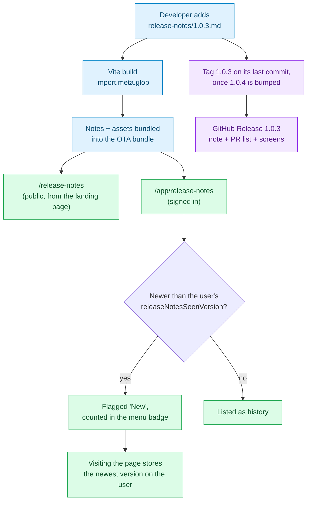

# release-notes/

**One markdown file per shipped version.** The app reads this folder directly:
[`src/features/release-notes/`](../src/features/release-notes/) bundles every file
here into the frontend build and renders them in two places — `/app/release-notes`
for signed-in users, who also get unread flagging, and `/release-notes` for
everyone else, linked from the landing page. Write for both: a note is read by
people who have not signed up yet.

These files are written for **users**, not for the changelog. If a change is
invisible to the person using TimeHuddle, it does not belong here — that is what
the git history and the PR description are for.

## The rule

```
release-notes/
  README.md          ← you are here (never rendered in-app)
  1.0.2.md           ← the note for version 1.0.2
  assets/
    1.0.2/           ← every image or clip referenced by 1.0.2.md
      clock-in.png
```

- **The filename is the version.** `1.0.2.md` is the note for `1.0.2` — the same
  version the OTA bundle ships under. The file's `version:` field must match its
  own filename, or the note is dropped from the page at build time. Nothing
  reports that, so check the page after adding a note.
- **Anything that isn't `<semver>.md` is ignored**, so this README never shows up
  in the app.
- **Assets live under `assets/<version>/`** — one folder per release, so deleting
  an old note never orphans someone else's screenshot.

## Adding a note

1. Decide the version. It is whatever `package.json` `version` will be when this
   change is published — check
   [`.github/workflows/ota-publish.yml`](../.github/workflows/ota-publish.yml):
   a push to `main` publishes a bundle at the current `package.json` version.
   If a note for that version already exists, **add to it** rather than creating
   a second file.
2. Copy the template below to `release-notes/<version>.md`.
3. Put any screenshots in `release-notes/assets/<version>/` — the PRs going
   into the release usually have them already; see
   [Collecting screens from PRs](#collecting-screens-from-prs).
4. List those PRs at the end of the note, under **Pull requests in this
   release** (see the template).
5. Look at it: `npm run dev` → `/release-notes` (no login) or `/app/release-notes`.
   This is the only check there is — a bad version, a bad date or an image path
   that points at nothing drops the note from the page with no error anywhere,
   so if your release is missing, that is why.

### Template

```markdown
---
version: 1.0.3
date: 2026-09-25
title: A short, user-facing headline
---

A one- or two-sentence lead explaining what changed and why anyone should care.
Write it the way you'd explain it to a colleague who does not work on this code.

## The thing that changed

What it does now, and what it replaced. Screenshot if the change is visual:


## The other thing

- Short bullets are fine for smaller items
- Each one says what a user can now do

## Pull requests in this release

- Clocking in from the header ([#NNN](https://github.com/mieweb/timehuddle/pull/NNN))
- Faster attachment uploads ([#NNN](https://github.com/mieweb/timehuddle/pull/NNN))
```

The PR list is the last section. Describe each PR in plain words, not by its
commit-style title, and leave out Dependabot bumps and PRs nobody using the app
would notice (refactors, CI, tests).

Required frontmatter fields — all three, no others are read:

| Field     | Format           | Notes                                                  |
| --------- | ---------------- | ------------------------------------------------------ |
| `version` | semver (`1.0.3`) | Must equal the filename                                |
| `date`    | `YYYY-MM-DD`     | The day it ships, not the day you wrote it             |
| `title`   | plain text       | Shown as the release headline; keep it under ~60 chars |

## Assets

| Kind              | Format                                      | Where                |
| ----------------- | ------------------------------------------- | -------------------- |
| Still screenshot  | `.png` (`.jpg` for photographic content)    | `assets/<version>/`  |
| Short interaction | animated `.gif` or `.webp`, **under ~2 MB** | `assets/<version>/`  |
| Longer demo       | **YouTube link**, not a committed file      | in the markdown body |

Everything in `assets/` is bundled into the app's JavaScript build, and that
build is what gets pushed to phones as an OTA update. A 20 MB screen recording
in this folder is a 20 MB download for every user on cellular data, so:

- **Crop and compress stills.** Full-desktop screenshots of a single button are
  the most common offender.
- **Reach for a GIF only when motion is the point** — a drag, a transition, a
  multi-step flow. A still plus a sentence beats an 8 MB loop.
- **Video never gets committed.** Upload it to YouTube and link it. The page
  shows a bare URL as a link, not an embedded player, so say what the video
  shows: `[Watch the composer in action](https://youtube.com/shorts/…)`.

Reference assets with a path relative to this folder — `assets/1.0.3/clock-in.png`
— and always give the image real alt text. The build rewrites that path to the
hashed bundle URL; a path that matches no file drops the whole note from the
page, so check it renders before you ship.

### Collecting screens from PRs

Screenshots and recordings usually already exist in the descriptions and
comments of the PRs going into the release — reuse them rather than capturing new ones.

```bash
# PRs merged since the last release (dates are the two releases' ship days)
gh pr list --repo mieweb/timehuddle --state merged \
  --search "merged:2026-10-02..2026-10-20 -author:app/dependabot" \
  --json number,title --limit 100

# The media in one PR — description and comments, screenshots and YouTube links
gh pr view 624 --repo mieweb/timehuddle --json body,comments \
  -q '.body, .comments[].body' \
  | grep -oE 'https://github.com/user-attachments/assets/[0-9a-f-]+|https://(www\.)?youtu[^ )"]+' \
  | sort -u

# Download one (the URLs need an authenticated request)
curl -sL -H "Authorization: token $(gh auth token)" -o shot.png \
  https://github.com/user-attachments/assets/<id>
```

Where each kind goes:

| Media      | In-app note (`<version>.md`)                            | GitHub Release                   |
| ---------- | ------------------------------------------------------- | -------------------------------- |
| Screenshot | Download, crop, compress, commit to `assets/<version>/` | Paste the `user-attachments` URL |
| YouTube    | A link with a label that says what it shows             | The URL                          |
| Video      | **Never committed** — link the PR that shows it         | Paste the `user-attachments` URL |

A `user-attachments` URL can't go in the in-app note: it is not bundled, so it
would not load offline, and the build only resolves `assets/…` paths.

## Shipping a release

Every push to `main` republishes the bundle under the current `package.json`
version (see [`ota-publish.yml`](../.github/workflows/ota-publish.yml)), so a
version keeps picking up changes until the next bump. A version's tag goes on
the **last** commit that shipped under it, which is only known once the next
version's bump merges. That is when you tag and release the version before it.

When the bump to `1.0.7` merges, ship `1.0.6`:

1. Find the last `1.0.6` commit, the one just before the bump merge on `main`:
   ```bash
   git fetch origin
   git log origin/main --first-parent -2 --format='%h %s'   # bump merge, then the one to tag
   git show <sha>:package.json | grep '"version"'          # must say 1.0.6
   ```
2. Tag it and push the tag. Tags are the bare version, no `v` prefix:
   ```bash
   git tag -a 1.0.6 <sha> -m "1.0.6 — <title from the note>"
   git push origin 1.0.6
   ```
3. Write the Release body in a scratch file: the note's body (everything below
   the frontmatter, including its **Pull requests in this release** list), with
   `user-attachments` URLs in place of `assets/…` paths so the images show on
   GitHub, and any PR screenshots or videos that did not make it into the note.
4. Optionally, append the full PR list as a footer. This saves nothing; it
   returns the text GitHub's **Generate release notes** button would produce,
   shaped by [`.github/release.yml`](../.github/release.yml):
   ```bash
   gh api -X POST repos/mieweb/timehuddle/releases/generate-notes \
     -f tag_name=1.0.6 -f previous_tag_name=1.0.5 -q .body
   ```
   It lists every PR in the tag range. Expect it to differ from the note's own
   list, which covers what the note describes.
5. Publish it. **The title is the note's `title:`**, word for word:
   ```bash
   gh release create 1.0.6 --title "<title from the note>" --notes-file body.md
   ```
   The web form at `/releases/new` works too. Pick the tag, then paste the
   title and body.
6. Open https://github.com/mieweb/timehuddle/releases and check that the new
   release is marked **Latest** and its images and videos play.

Publishing a Release notifies everyone watching the repo. Do not publish one to
try things out — step 4 drafts the PR list without publishing anything.

If a note is corrected after its release is published, update the Release to
match: `gh release edit 1.0.6 --notes-file body.md`.

## How a note reaches the user



The "already seen" marker lives on the user document in the Meteor backend
(`releaseNotesSeenVersion`), not in `localStorage` — so a user who reads the
notes on their laptop does not see them flagged as new on their phone.

## Prior art

The model here is deliberately VS Code's: notes are keyed by **version** rather
than by a timestamp, because "everything since your last login" breaks for anyone
who happens to log in halfway through a deploy. Keep a Changelog's
`Added/Changed/Fixed` headings are a reasonable fallback structure for a release
with a lot of small items, but prose beats a category list when there is one
thing worth talking about.
